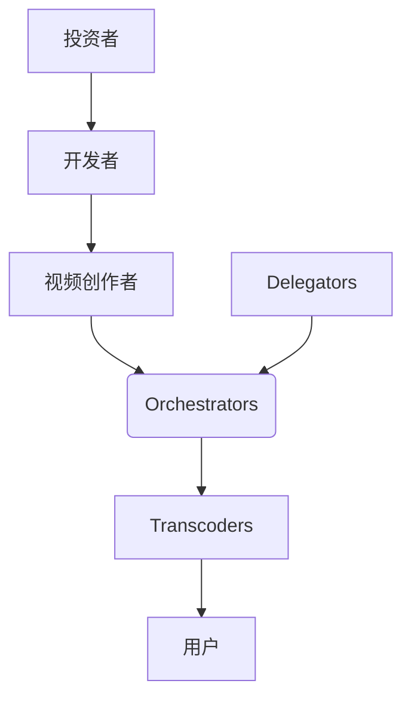

# Livepeer研报：基于以太坊的去中心化视频流协议

## 项目概览

Livepeer是以太坊生态中创新性去中心化视频流解决方案，通过区块链技术重构传统视频分发体系。该协议利用全球分布式节点资源，为开发者提供经济高效的视频转码服务，其核心优势在于：

- 基于PaaS架构的可扩展性
- 修改版DPoS共识机制
- 原生代币LPT的激励生态
- 去中心化基础设施安全架构

👉 [探索去中心化视频生态新纪元](https://bit.ly/okx_welcome)

## 核心技术架构解析

### 视频转码工作流

Livepeer网络通过三层架构实现高效视频处理：

| 处理阶段 | 参与角色 | 关键操作 |
|---------|----------|----------|
| 任务接收 | Orchestrators | 接收原始视频流 |
| 任务分配 | Orchestrators | 分配转码任务 |
| 执行转码 | Transcoders | 多格式转换处理 |
| 质量验证 | Orchestrators | 结果审核回传 |

**关键技术创新：**
- 动态转码参数调整（分辨率/比特率/编码标准）
- 随机抽查验证机制降低验证成本
- GPU资源弹性调度系统

### 双层共识机制

**以太坊区块链层**
- 所有财务操作透明记录（LPT质押/解质押）
- 智能合约自动执行奖励分配
- 利用以太坊安全基底保障资产安全

**DPoS验证层**
- LPT质押量决定任务分配权重
- 节点交叉验证确保服务质量
- 动态通胀模型调节网络参与度

👉 [了解底层技术如何赋能视频生态](https://bit.ly/okx_welcome)

## 代币经济模型

### LPT核心功能矩阵

- **网络治理**：协议升级投票权
- **服务支付**：转码费用结算单位
- **安全抵押**：恶意行为保证金
- **收益分配**：通胀奖励池分配

**代币分配结构：**
```plaintext
创始团队 12.35% (3年锁定期)
预售份额 19%
公开流通 63.437%
早期贡献者 0.213%
生态发展基金 5%
```

**动态通胀机制：**
- 年通胀率3%-15%浮动
- 质押率＞50%时降低通胀
- 质押率＜30%时提升激励

### 质押收益计算器（示例）

| 质押量(LPT) | 年化收益率 | 月收益估算 |
|------------|------------|------------|
| 1000       | 8.2%       | 6.83 LPT   |
| 5000       | 9.1%       | 37.92 LPT  |
| 10000      | 9.8%       | 81.67 LPT  |

## 生态系统构成

### 参与角色全景图



**核心参与者价值主张：**
- **Orchestrators**：硬件投资回报率提升30%
- **Delegators**：零运维参与收益分配
- **视频创作者**：带宽成本降低60%
- **用户**：观看延迟减少至1.2秒

## 商业模式对比分析

| 维度          | Livepeer         | YouTube        | Twitch         |
|---------------|------------------|----------------|----------------|
| 转码成本      | $0.004/分钟      | $0.05-0.1/分钟 | $0.03-0.08/分钟|
| 带宽费用      | 动态竞价模式     | 固定费率       | 合约定价       |
| 内容审核      | 自动化AI检测     | 人工+AI混合    | 人工审核为主   |
| 收益分成      | 100%归创作者     | 45%平台抽成    | 50%平台抽成    |
| 数据所有权    | 完全自主         | 平台控制       | 平台控制       |

👉 [解密去中心化视频平台的商业潜力](https://bit.ly/okx_welcome)

## 发展历程与生态合作

### 里程碑事件

- 2021.11 收购MistServer提升流媒体性能
- 2022.12 投资Web3 Working Group推动生态建设
- 2023.03 与Band Protocol集成预言机服务
- 2023.07 完成B-II轮2000万美元融资

**战略合作伙伴矩阵：**
- **基础设施**：Parity Technologies
- **数据服务**：Band Protocol
- **开发者生态**：ETHDenver
- **内容平台**：DLive

## 市场竞争格局

### SWOT分析

**优势(Strengths)**
- 边缘计算节点降低延迟
- 通证经济持续激励生态
- 开源社区快速迭代能力

**劣势(Weaknesses)**
- 用户界面复杂度较高
- 初期节点集中度问题
- 法律合规框架待完善

**机会(Opportunities)**
- Web3.0视频应用爆发
- 元宇宙内容需求激增
- 隐私计算技术融合

**威胁(Threats)**
- 传统平台价格战
- 监管政策不确定性
- 同类项目竞争加剧

## 未来技术路线图

### 2024-2025关键升级

- **AI转码优化引擎**：画质提升40%同时降低带宽
- **ZK-Rollups扩容方案**：处理速度提升至1000TPS
- **多链部署计划**：跨链支持Polygon/Avalanche
- **NFT内容确权**：集成ERC-721数字版权管理

**价格预测模型：**
| 年份 | 乐观预测 | 中性预测 | 保守预测 |
|------|----------|----------|----------|
| 2024 | $14.77   | $11.20   | $8.35    |
| 2025 | $19.87   | $16.81   | $14.19   |
| 2026 | $25.66   | $21.87   | $18.25   |

## FAQ精选

### 如何参与Livepeer网络？
用户可通过三种方式参与：
1. 质押LPT成为Delegator
2. 部署节点作为Orchestrator
3. 提供GPU资源担任Transcoder

### 如何确保视频转码质量？
网络采用双重保障机制：
- 随机抽查验证+声誉评分系统
- 经济惩罚（Slashing）机制

### 与传统平台的核心差异？
Livepeer在三个维度实现突破：
1. 成本结构：降低60%-80%运营费用
2. 数据主权：用户完全掌控内容
3. 去中心化治理：DAO决策机制

### 面临哪些监管挑战？
主要合规领域包括：
- 数字内容审核标准
- 跨境数据流动管理
- 证券型通证认定

### 如何获取LPT代币？
主要途径包括：
1. 交易所购买（OKX/Binance）
2. 质押收益获取
3. 贡献生态奖励

👉 [把握机遇参与去中心化视频革命](https://bit.ly/okx_welcome)