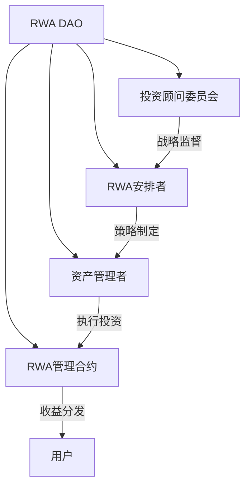

# Tron推出stUSDT：加密世界的余额宝能否引领RWA新风潮？

## RWA赛道崛起：现实世界资产如何撬动DeFi市场？

随着宏观经济环境的变化，去中心化金融（DeFi）正在经历结构性变革。现实世界资产（RWA）通过区块链技术实现资产代币化，正在成为DeFi领域最具潜力的收益来源之一。MakerDAO通过RWA Vault实现年利润7367万美元的亮眼表现，DefiLama数据显示RWA概念币近月涨幅显著，这些现象都预示着实体资产代币化已进入爆发前夜。

波场TRON创始人Justin Sun宣布的stUSDT产品，正是瞄准这一市场机遇的创新尝试。这款被定位为"加密余额宝"的产品，将通过JustLend协议构建传统金融与加密世界的桥梁。值得注意的是，该产品上线首期即提供10%年化补贴，远超Aave、MakerDAO等主流平台的2.6%-3.49%收益率。

👉 [探索高收益DeFi产品奥秘](https://bit.ly/okx_welcome)

---

## stUSDT深度解析：如何打造加密世界的普惠理财？

### 核心机制创新

stUSDT通过"质押USDT→获取stUSDT凭证→享受RWA收益"的三层架构，实现了三大突破：

| 传统模式 vs stUSDT创新 | 传统银行理财 | stUSDT模式 |
|------------------------|--------------|------------|
| 起投门槛               | 万元级       | 1 USDT起投 |
| 收益获取               | 定期结算     | 每日Rebase自动复利 |
| 资产透明度             | 季度报告     | 链上实时可查 |

这种设计既保留了区块链技术的透明性优势，又通过现实资产锚定（RWA）解决了加密资产波动性难题。用户持有的stUSDT代币不仅具备TRC-20标准的流通性，还能通过Rebase机制实现持有量的线性增长。

### RWA DAO治理体系

stUSDT的运营采用去中心化自治组织（DAO）架构，形成多方制衡的治理生态：



这种四层治理结构确保了投资决策的专业性和安全性，其中：
- 投资顾问委员会由TradFi与DeFi专家组成，负责风险控制
- RWA安排者需定期披露投资组合表现
- 智能合约自动执行收益分配，减少人为干预风险

👉 [了解去中心化理财新玩法](https://bit.ly/okx_welcome)

---

## FAQ：关于stUSDT的十大核心问题

**Q：stUSDT如何保障本金安全？**  
A：通过双重风控机制：1）仅投资高评级RWA资产；2）智能合约隔离资产，审计报告显示其TVL（总锁仓量）始终与stUSDT发行量1:1锚定。

**Q：与传统余额宝有何本质区别？**  
A：核心差异在于底层资产。传统余额宝投资货币基金，stUSDT则配置商业票据、国债等RWA资产，且收益通过区块链技术实现每日自动复利。

**Q：年化10%的收益是否具有可持续性？**  
A：首期补贴包含项目方激励资金池支持，长期收益将根据RWA市场表现浮动，当前预测稳定期收益率仍可达5%以上，是行业平均的2倍。

**Q：普通用户如何参与？**  
A：三步操作：1）在TRON钱包质押USDT；2）获得等量stUSDT；3）每日Rebase自动增加持仓量。平台提供可视化仪表盘实时追踪收益。

**Q：stUSDT对DeFi行业有何影响？**  
A：开创了"链下资产上链收益"新模式，预计可为DeFi市场注入超万亿美元流动性，同时降低机构级投资门槛至个人用户可触及水平。

---

## RWA赛道全景：万亿市场的破局之战

### 竞争格局分析

| 项目        | 资产类别   | 收益模式     | 年化收益 | TVL规模 |
|-------------|------------|--------------|----------|---------|
| MakerDAO    | 美债       | DSR存款利率  | 3.49%    | $81亿   |
| Aave RWA    | 企业信贷   | 流动性挖矿   | 2.83%    | $23亿   |
| stUSDT      | 多元资产池 | RWA凭证收益  | 10%*     | $待上线 |
| Ondo Finance| 短期国债   | 质押收益     | 4.2%     | $15亿   |

*数据来源：DeFiLlama，注：stUSDT为首发补贴利率

TRON选择以USDT作为切入点具有战略意义：作为市值1300亿美元的稳定币市场龙头（市占率62%），USDT的流动性优势为stUSDT提供了天然的用户基础和资金池规模效应。

### 未来发展趋势

高盛研究报告指出，RWA赛道将在2025年迎来拐点，关键驱动因素包括：
1. 各国央行数字货币（CBDC）的推进
2. 传统金融机构合规通道的打通
3. DeFi协议对现实资产的适配优化

波士顿咨询预测，到2030年RWA市场规模可能达到16万亿美元，这相当于为DeFi市场打开8倍于当前加密货币总市值的增长空间。stUSDT的推出，正是抢占这一蓝海市场的重要战略落子。

---

## 投资者操作指南：从入门到进阶

### 基础操作流程

1. **准备阶段**
   - 注册TRON钱包（如TokenPocket）
   - 获取USDT（TRC-20格式）
   - 访问stUSDT官方质押页面

2. **质押操作**
   ```markdown
   [质押界面]
   输入金额 → 授权USDT合约 → 确认铸造stUSDT → 完成
   ```

3. **收益管理**
   - 每日Rebase：stUSDT持仓自动增长
   - 复投策略：定期解质押再投资扩大本金
   - 收益提取：随时将stUSDT转回USDT

### 高级玩法

- **流动性挖矿**：将stUSDT/USDT交易对添加至JustSwap，获取双重收益
- **跨链套利**：关注stUSDT在不同交易所的溢价机会
- **DAO治理**：持有stUSDT参与RWA投资决策投票

👉 [开启您的链上财富之旅](https://bit.ly/okx_welcome)

---

## 风险与机遇并存：专业机构如何看待？

### 机构投资者观点

| 机构       | 看法摘要 |
|------------|----------|
| 花旗银行   | 预计2030年代币化证券规模达4-5万亿美元，RWA是连接传统金融与区块链的关键桥梁 |
| 贝莱德     | 推出BUIDL基金布局美债代币化，认为stUSDT等产品将加速机构资金入场 |
| BCG        | 预测RWA市场2030年或达16万亿美元，远超当前加密市场总规模 |
| 摩根大通   | 已试点JPM Coin与RWA结合，认为stUSDT的DAO治理模式具有创新意义 |

### 风险提示

1. **监管风险**：各国对RWA的合规要求尚不统一，需关注美国SEC监管动态
2. **技术风险**：智能合约漏洞可能导致资金损失，建议选择审计完善的产品
3. **市场风险**：底层RWA资产价格波动可能影响收益稳定性

---

## 结语：重新定义财富管理的边界

stUSDT的推出标志着DeFi进入3.0时代，其价值不仅在于提供高收益理财工具，更在于开创了"人人皆可参与机构级投资"的新范式。通过区块链技术将228万亿美元的房地产、133万亿美元的债券市场等传统资产转化为可编程的链上资产，这种变革将重塑全球财富管理格局。

对于普通投资者而言，stUSDT降低了参与优质RWA资产的门槛，1 USDT即可享受原本只有机构才能获取的收益机会。随着TRON生态的持续扩展和RWA赛道的成熟，这类产品有望成为连接现实经济与数字经济的核心枢纽，为市场注入万亿级新增流动性。

未来半年将是验证RWA商业模式的关键窗口期，stUSDT的市场表现或将直接影响整个赛道的发展进程。在这个传统金融与加密经济加速融合的时代，把握住RWA这把钥匙，或许就意味着打开了通向下一个牛市的通道。