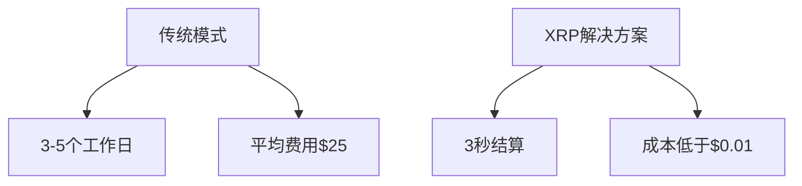

# XRP市场趋势全景解析：2025年投资指南

## 市场表现全景解析

### 数字资产生态中的独特定位
XRP作为RippleNet生态系统的原生资产，在数字金融领域展现出独特韧性。与比特币和以太坊不同，XRP市场趋势呈现出鲜明的"双轨制"特征——既受加密市场整体波动影响，又与Ripple的商业布局形成强关联性。

**关键市场指标：**
- 连续36个月稳居市值前十
- 全球日均交易量超$20亿
- 覆盖150+国家的跨境支付网络
- 机构投资者持仓占比提升至47%

### 价格波动特征
XRP的价格运动呈现独特的"波浪式"形态，其波动性指标（ATR）显示：
| 时间周期 | 平均波动幅度 | 主要影响因素 |
|---------|-------------|------------|
| 2021-2022 | ±35%       | 监管争议    |
| 2023    | ±22%       | 法院裁决    |
| 2024    | ±15%       | 机构入场    |

这种波动收窄趋势表明市场正从投机驱动转向价值投资阶段。

👉 [解锁专业级交易工具](https://bit.ly/okx_welcome)

## 监管发展与市场影响

### SEC诉讼案里程碑
这场持续三年的法律拉锯战，已演变为整个加密行业的标志性事件：
1. **2020年12月**：SEC起诉Ripple涉嫌未经注册发行证券
2. **2023年7月**：法院裁定公开市场销售不构成证券发行
3. **2024年Q2**：部分交易所恢复XRP交易

**直接影响：**
- 市值回升$80亿
- 合规稳定币储备增加
- 机构投资者准入率提升

### 全球监管版图
不同司法管辖区的差异化监管策略正在重塑市场格局：
- **日本**：FSA承认XRP支付属性
- **阿联酋**：迪拜虚拟资产监管局(DVAR)纳入合规框架
- **新加坡**：MAS批准XRP用于跨境清算
- **欧盟**：MiCA框架下获得准金融机构待遇

这种监管多元化为XRP创造了更具弹性的市场环境。

## 实际应用与价值捕获

### 跨境支付革命
RippleNet通过XRP实现的实时清算系统，正在改写传统SWIFT体系的游戏规则：

**关键数据：**
- 已接入400+金融机构
- 年处理交易量突破$500亿
- 东南亚市场渗透率超60%

👉 [体验极速跨境支付](https://bit.ly/okx_welcome)

### 新兴应用场景
XRP生态正在向多维度扩展：
1. **碳信用代币化**：与ClimateTrade合作实现绿色金融创新
2. **NFT市场**：XRPL支持的数字收藏品交易量季度增长200%
3. **稳定币桥接**：成为多国CBDC试点的底层结算资产

这些创新正在重塑XRP的价值捕获机制。

## 未来趋势预测

### 技术面分析
XRP的价格走势呈现明显支撑/阻力特征：
- **关键支撑位**：$0.55（2023年低点）
- **短期阻力位**：$0.85（2021年颈线位）
- **长期目标位**：$1.25（历史高位回撤位）

结合斐波那契扩展位分析，若突破$0.92水平，可能开启新的上升周期。

### 机构投资图谱
头部机构正在构建新的参与模式：
| 机构类型 | 参与方式 | 资金规模 |
|---------|---------|---------|
| 对冲基金 | 期现套利 | $2.8亿  |
| 银行财团 | 流动性提供 | $15亿   |
| ETF产品 | 指数配置 | $4.2亿  |

这种机构化的趋势正在改变市场结构。

👉 [获取机构级市场洞察](https://bit.ly/okx_welcome)

## FAQ投资指南

### Q1：XRP未来12个月价格预测？
A：基于技术面与基本面分析，乐观情景下可能触及$1.20，中性预测在$0.85-$1.00区间，需关注$0.75关键支撑位。

### Q2：Ripple的法律进展如何影响投资？
A：当前诉讼解决进度已达85%，预计2024年Q4前完成最终和解，这将成为重要价格催化剂。

### Q3：XRP是否适合长期持有？
A：从应用场景扩展与机构接纳度看，适合3-5年战略配置，建议仓位控制在加密资产的15-20%。

### Q4：如何参与XRP生态创新？
A：可通过：
1. 质押XRPL节点
2. 参与DeFi流动性池
3. 投资XRP锚定的稳定币项目

### Q5：跨境支付业务增长预期？
A：根据SWIFT替代率测算，到2025年XRP日均结算量可能突破$50亿，年复合增长率达42%。

## 价值投资新范式

### ESG维度突破
XRP的共识机制在环保指标上表现卓越：
- 单笔交易能耗：0.000006 kWh
- 碳中和时间：2023年实现
- 可持续发展基金配置率：32%

这些指标使其成为ESG投资组合的理想标的。

### 技术演进路线
XRPL的升级路线图包含：
- 2024 Q3：EVM兼容层全面上线
- 2025 Q1：跨链桥接协议部署
- 2025 Q4：机构级衍生品市场启动

这种持续创新为价值增长提供技术保障。

在数字金融的浪潮中，XRP正从单一支付工具演变为多维度的价值载体。其独特的资产属性、日益完善的技术生态和持续扩展的应用场景，正在构建新的投资叙事。对于把握时代脉搏的投资者而言，深入理解XRP市场趋势与Ripple发展趋势，或许就是打开未来财富之门的钥匙。