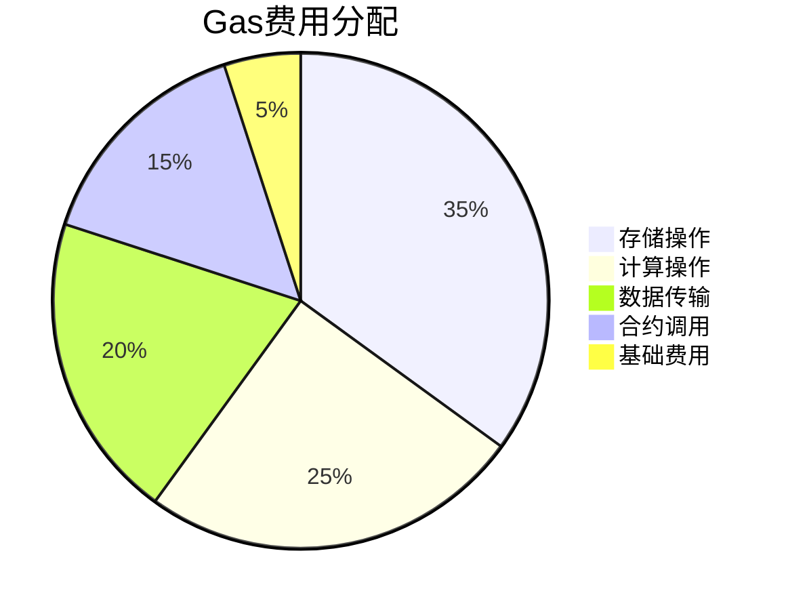

```markdown
# 以太坊设计原理深度解析

## 区块链架构核心原则

以太坊协议的设计遵循五大核心原则，这些原则构成了其区别于其他区块链系统的技术基础：

### 三明治复杂模型
底层协议保持极简设计，复杂功能下沉至中间层。这种分层架构使核心共识层保持稳定，而高级功能如编译器、数据序列化等可灵活迭代。例如，存储数据结构模型的优化不会影响区块链核心验证逻辑。

### 开放性原则
通过交易费用机制实现网络资源的市场化配置，既保障矿工收益又抑制恶意攻击。这种类似庇古税的经济模型，成功平衡了网络中立性与安全性需求。

### 泛化设计哲学
操作码设计遵循"基本粒子"原则，通过LOG操作码的抽象化设计，实现了合约信息传递与事件记录的分离，为去中心化应用开发提供灵活基础。

### 风险收益权衡
主动采用广义状态转换、快速区块时间等高风险方案，换取性能提升。这种技术取舍使以太坊区块时间达到50倍于比特币的效率。

## 账户模型技术解析

### 账户与UTXO对比
通过账户模型替代比特币的UTXO结构，实现显著优化：

| 对比维度       | UTXO模型               | 账户模型               |
|----------------|-----------------------|-----------------------|
| 存储效率       | 300字节/账户          | 30字节/账户           |
| 交易复杂度     | 多输入输出处理        | 单账户余额变更        |
| 智能合约支持   | 需复杂脚本实现        | 原生支持状态变更      |
| 隐私保护       | 高（需新地址机制）    | 中（需合约混合器）    |

### 重放攻击防护
采用nonce机制配合区块时间戳重置策略，有效解决交易重复提交问题。当前方案虽存在状态膨胀缺陷，但通过Ping机制设计为后续优化保留空间。

## 核心数据结构

### Merkle Patricia Trie特性
- **抗碰撞性**：2^128级哈希强度保障数据不可篡改
- **动态更新**：对数时间复杂度支持高频状态变更
- **空间优化**：16进制节点设计提升存储效率30%

### RLP编码优势
相较于BSON/Protobuf，RLP通过纯字节数组结构实现：
- 0.8倍数据体积压缩率
- 多语言实现一致性
- 避免浮点数等复杂类型歧义

👉 [查看区块链开发工具包](https://bit.ly/okx_welcome)

## 共识机制创新

### Uncle区块激励机制
| 参数            | 数值       | 作用                     |
|-----------------|------------|--------------------------|
| 区块时间        | 12秒       | 网络延迟平衡点           |
| Uncle奖励比例   | 7/8        | 算力分散化激励           |
| Nephew奖励比例  | 1/32       | 分叉收敛加速             |
| 最大追溯深度    | 7层        | 安全性与效率最优平衡     |

### 难度调整算法
动态调整公式：  
`diff(block) = parent_diff + parent_diff ÷ 1024 × sign(9 - block_time)`

该算法在测试网实现：
- 算力波动50%时，难度收敛时间<2小时
- 区块时间标准差控制在±3秒内

## Gas经济模型

### 费用构成体系


### 动态定价机制
通过矿工投票实现gas limit弹性调整：
- 每区块调整幅度±0.0975%
- 网络拥堵时自动触发扩容
- 避免拍卖机制导致的费用波动

👉 [探索加密货币投资机会](https://bit.ly/okx_welcome)

## 虚拟机架构

### EVM设计特征
- **栈机架构**：32字节标准字宽，兼容加密运算
- **存储分层**：内存(0.1$/MB)与持久存储(100$/MB)定价差异
- **安全边界**：1024调用深度限制防御递归攻击

### 特色操作码
| 操作码     | 功能                      | 应用场景               |
|-----------|---------------------------|------------------------|
| ADDMOD    | 模运算加速                | 椭圆曲线加密           |
| SIGNEXTEND| 有符号整数转换            | JIT编译优化            |
| EXTCODECOPY| 合约代码验证             | 安全审计               |

## FAQ

Q: 账户模型是否影响隐私性？
A: 通过LOG操作码与合约混合器设计，可实现与UTXO相当的隐私保护，同时保持开发便利性。

Q: Gas价格如何避免市场操纵？
A: 采用矿工投票机制与弹性gas limit，既反映网络负载又抑制价格剧烈波动。

Q: EVM为何采用栈式架构？
A: 代码密度提升4倍，符合"三明治模型"中间层优化原则，复杂计算由WASM等后续方案承接。

👉 [获取区块链技术前沿动态](https://bit.ly/okx_welcome)
```
