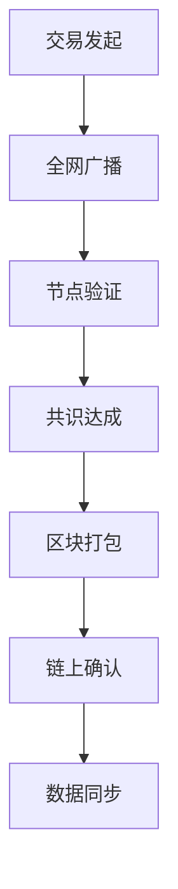

# 区块链知识大全

## 一、区块链基础认知
### 1.1 什么是区块链
区块链是一种分布式账本技术，通过去中心化架构实现交易与数据的永久存储。其核心特征是将数据分组为按时间顺序连接的"区块"，每个新区块通过哈希算法与前序区块绑定，形成不可逆的链式结构。这种技术突破性地解决了数字世界的信任构建问题，使参与者无需依赖第三方中介机构即可完成可信交易。

👉 [解密区块链技术原理](https://bit.ly/okx_welcome)

### 1.2 技术演进与现状
区块链技术起源于2008年比特币白皮书，但经过十余年发展已突破加密货币范畴。全球主要经济体均在探索其应用场景，中国将区块链纳入"十四五"数字经济规划，美国在供应链金融领域实现规模化应用。值得关注的是，各国监管机构对区块链技术本身持开放态度，但对加密货币交易实施差异化管理。

### 1.3 核心优势解析
- **信任重构**：通过数学算法替代中心化信任机制
- **成本优化**：点对点交易减少中介服务费用
- **效率提升**：自动化智能合约缩短业务处理周期
- **安全增强**：分布式存储降低数据篡改风险

## 二、技术运行机制
### 2.1 交易全流程解析


### 2.2 共识算法演进
| 算法类型      | 能耗效率 | 安全等级 | 典型应用     |
|---------------|----------|----------|--------------|
| 工作量证明(PoW) | 低       | 高       | 比特币       |
| 权益证明(PoS)  | 中       | 中       | 以太坊2.0    |
| 委托权益证明(DPoS) | 高      | 中       | EOS          |
| 实用拜占庭容错(PBFT) | 高    | 高       | 联盟链       |

👉 [区块链共识机制深度解析](https://bit.ly/okx_welcome)

### 2.3 数据不可篡改原理
区块链通过三重机制保障数据安全：
1. **哈希链式结构**：单个区块修改将导致后续所有区块哈希值变更
2. **分布式存储**：全网节点共同维护数据副本
3. **密码学保护**：采用椭圆曲线加密(ECC)和SHA-256算法

## 三、技术特性矩阵
### 3.1 核心特征对比
- **去中心化程度**：公有链>联盟链>私有链
- **数据透明性**：公有链全公开，私有链可定制
- **交易效率**：私有链>联盟链>公有链
- **部署成本**：联盟链综合成本最低

### 3.2 技术局限性
| 挑战维度       | 具体表现                     | 解决路径                 |
|----------------|------------------------------|--------------------------|
| 扩展性瓶颈     | 比特币每秒处理7笔交易        | 分片技术/侧链/Layer2方案 |
| 隐私保护       | 公有链数据完全透明           | 零知识证明/同态加密      |
| 能源消耗       | PoW机制高能耗                | 转向PoS/绿色能源挖矿     |
| 法规合规       | 跨境交易监管差异             | 监管沙盒/合规稳定币      |

## 四、应用生态全景图
### 4.1 主流应用场景
**金融领域**：
- 跨境支付：SWIFT结算需2-3天，Ripple方案缩短至4秒
- 去中心化交易所(DEX)：2023年交易量突破1.2万亿美元

**实体产业**：
- 供应链溯源：沃尔玛采用Hyperledger实现食品溯源
- 数字身份认证：欧盟eIDAS标准兼容区块链方案

**新兴赛道**：
- NFT市场：OpenSea平台年交易额达250亿美元
- 元宇宙资产：Decentraland虚拟土地成交价超240万美元

👉 [区块链应用场景创新案例](https://bit.ly/okx_welcome)

### 4.2 行业渗透率分析
```plaintext
金融行业          38%
制造业          22%
政务管理        15%
医疗健康        10%
教育文化        8%
其他            7%
```

## 五、核心技术栈
### 5.1 技术架构分层
1. **数据层**：Merkle树结构保障数据完整性
2. **网络层**：P2P协议实现节点通信
3. **共识层**：PoW/PoS等算法确保数据一致性
4. **合约层**：Solidity语言构建智能合约
5. **应用层**：DApp生态持续扩展

### 5.2 开发平台对比
- **以太坊**：智能合约市场占有率68%，但Gas费较高
- **Hyperledger**：企业级解决方案，模块化架构
- **Polkadot**：跨链技术领先，平行链插槽拍卖机制
- **国产平台**：蚂蚁链服务超5000家企业，腾讯云TBaaS

## 六、常见问题解答
**Q：区块链会取代传统银行吗？**  
A：短期内可能性较低。区块链更可能与传统金融体系形成互补，如跨境支付场景的协作应用。

**Q：普通用户如何参与区块链？**  
A：可通过数字钱包管理资产、参与DeFi质押、NFT收藏或成为节点验证者等方式参与。

**Q：区块链数据存储成本如何？**  
A：公有链存储成本较高，IPFS等分布式存储方案正在成为有效补充。

**Q：中国区块链发展现状？**  
A：数字人民币试点已覆盖多场景，政务区块链平台"长安链"实现自主可控。

**Q：区块链技术成熟度如何？**  
A：处于Gartner技术成熟度曲线的期望膨胀期，核心技术创新周期约3-5年。

## 七、未来发展趋势
1. **技术融合**：与AI、IoT结合催生智能合约2.0
2. **监管科技**：合规化将成为主流发展方向
3. **绿色转型**：碳足迹追踪应用将快速增长
4. **跨链互通**：Cosmos与Polkadot生态加速融合

区块链技术正从概念验证走向规模化落地，其价值重构潜力将在数字经济时代持续释放。随着技术标准的完善和监管框架的明晰，区块链将在构建可信数字基础设施方面发挥关键作用。