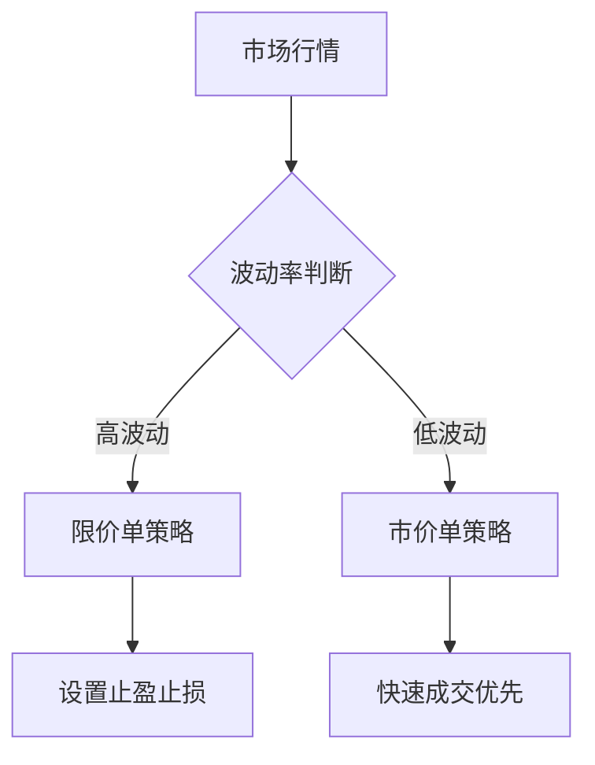

# 如何出售XRP：加密货币交易者分步指南

## 准备阶段：理解XRP与交易基础

XRP是Ripple网络推出的数字资产，专为跨境支付设计。这种数字货币通过去中心化区块链技术，实现了三大核心优势：

- **秒级结算**：交易确认时间仅需4-5秒
- **超低成本**：单笔交易费用约0.00001 XRP
- **高扩展性**：每秒处理1500笔交易

👉 [选择可靠交易平台指南](https://bit.ly/okx_welcome)

### Ripple网络的商业价值
作为金融机构的首选解决方案，RippleNet已连接全球300+家银行。其独特优势包括：
- 标准化协议确保跨境支付一致性
- 共识算法替代传统挖矿机制
- 支持多币种实时结算（法币/加密货币/商品）

> 重要提示：2020年SEC诉讼案虽对市场造成短期波动，但XRP仍保持全球前五市值地位（截至2024年数据）

## 出售XRP的完整操作流程

### 第一步：钱包配置与资产转移
必须使用支持XRP的数字钱包，常见类型对比：

| 钱包类型   | 代表产品          | 安全等级 | 交易便捷度 |
|------------|-------------------|----------|------------|
| 硬件钱包   | Ledger Nano X     | ★★★★★    | ★★★☆☆      |
| 网页钱包   | GateHub           | ★★★☆☆    | ★★★★★      |
| 移动钱包   | Toast Wallet      | ★★★★☆    | ★★★★☆      |

**转移操作指南**：
1. 登录交易所获取XRP充值地址
2. 从钱包发起转账时需注意：
   - 最低预留要求：20 XRP
   - 手续费标准：0.00001 XRP
   - 网络拥堵时段建议提前操作

### 第二步：交易策略选择
根据市场状况选择合适策略：

**订单类型对比**：
- 市价单：立即以当前价格成交
- 限价单：指定价格触发（推荐使用）
- 止损单：价格下跌至预设值自动卖出

### 第三步：资金提现与税务处理
提现流程标准化步骤：
1. 选择提现方式（银行电汇/支付宝/USDT等）
2. 核对手续费率（通常0.1%-1%）
3. 等待处理时间（银行转账1-3个工作日）

**税务申报要点**：
- 中国地区：按财产转让所得20%税率
- 美国地区：区分短期（<1年）37%与长期（>1年）28%税率
- 欧盟地区：各国政策差异显著（如德国免税期1年）

## 风险管理与市场洞察

### 实时监测工具推荐
| 工具类型   | 推荐平台               | 核心功能                   |
|------------|------------------------|----------------------------|
| 行情分析   | CoinMarketCap          | 实时价格/交易量/市值排名   |
| 技术指标   | TradingView              | K线图/RSI/MACD等分析工具   |
| 新闻聚合   | Coindesk               | 政策法规/行业动态更新      |

### 常见问题解答（FAQ）

**Q1：如何选择最佳出售时机？**
A：结合技术面与基本面分析，建议关注：
- 美联储货币政策动向
- Ripple诉讼案进展
- 全球跨境支付市场份额变化

**Q2：XRP被交易所下架怎么办？**
A：立即转移至支持XRP的平台，当前主要支持方：
- OKX（全球TOP3交易所）
- Gate.io
- Binance（部分区域支持）

**Q3：冷钱包存储的XRP如何快速变现？**
A：操作流程：
1. 连接硬件钱包至交易所
2. 扫描二维码完成身份验证
3. 即时发起链上转账

👉 [冷钱包安全操作指南](https://bit.ly/okx_welcome)

## 持续优化交易策略

### 组合投资建议
分散风险的最佳实践：
- 配置比例：XRP不超过数字资产组合的25%
- 对冲工具：使用比特币/黄金进行反向对冲
- 定期复盘：每月评估持仓表现

### 法规合规要点
重点关注地区合规要求：
- 美国：需使用合规交易平台（如Coinbase）
- 欧盟：遵循MiCA新规（2024年实施）
- 新加坡：MAS许可经营框架

> 专业建议：建立包含交易记录、税务凭证、合规文件的完整档案体系

## 进阶操作技巧

### 大额交易注意事项
| 资产规模   | 推荐操作                     | 风险提示               |
|------------|------------------------------|------------------------|
| <10万USD   | 单笔市价单                   | 价差影响小             |
| 10-100万USD| 分批挂单+冰山订单            | 避免市场冲击           |
| >100万USD  | OTC场外交易+算法拆单         | 需专业机构协助         |

👉 [大额交易解决方案](https://bit.ly/okx_welcome)

### 衍生品对冲策略
- 期货合约：双向开仓锁定收益
- 永续合约：资金费率成本需精确计算
- 期权组合：构建保护性看跌策略

通过系统化的操作框架与持续的市场洞察，交易者可以最大化XRP交易的价值实现。建议每季度更新交易策略，结合最新监管动态与技术创新趋势进行动态调整。